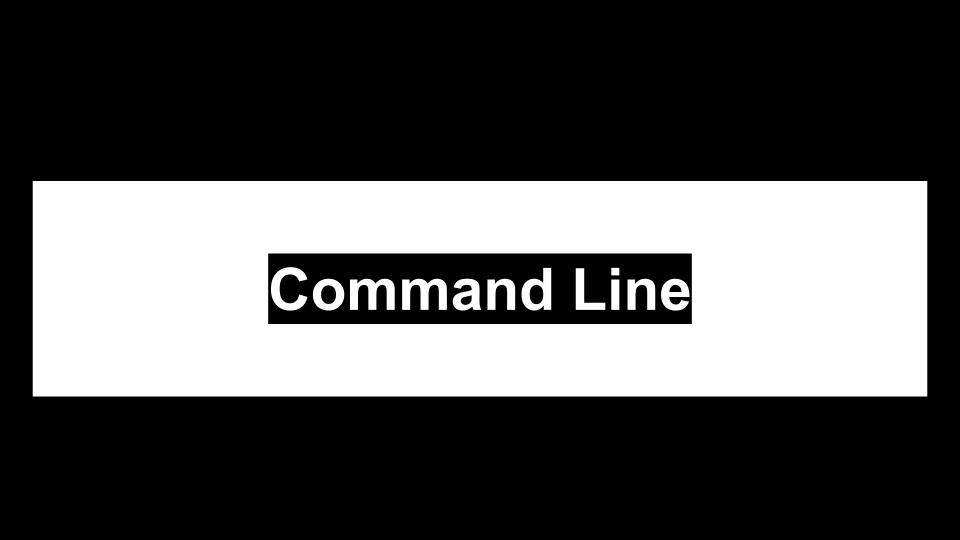
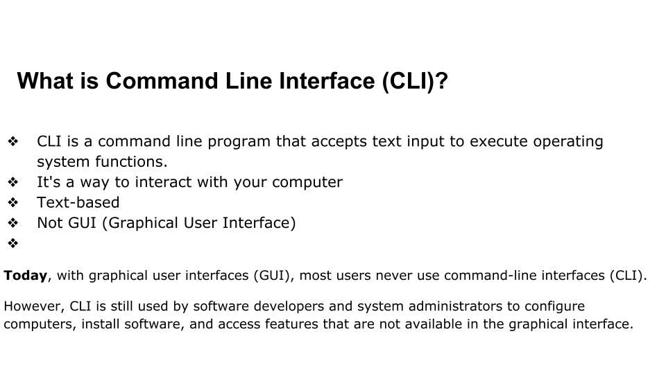
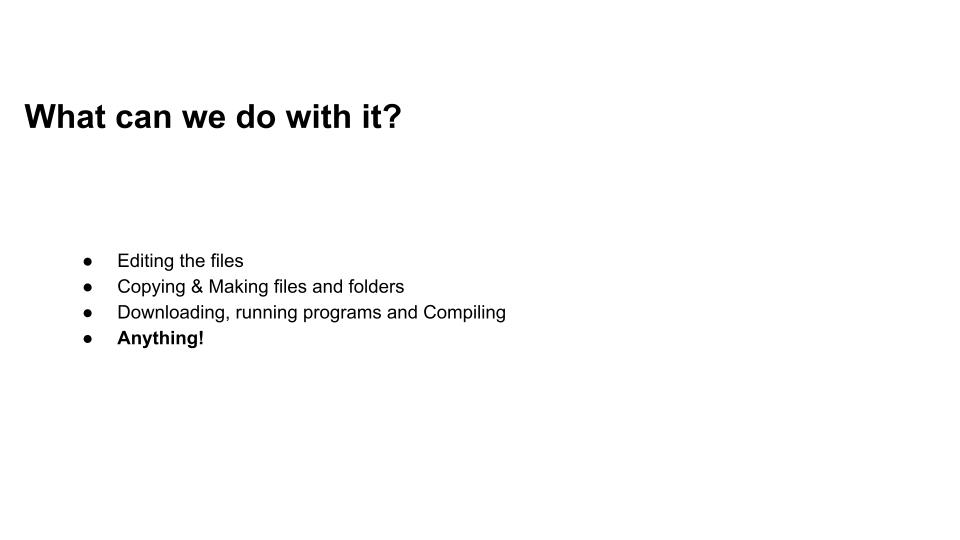
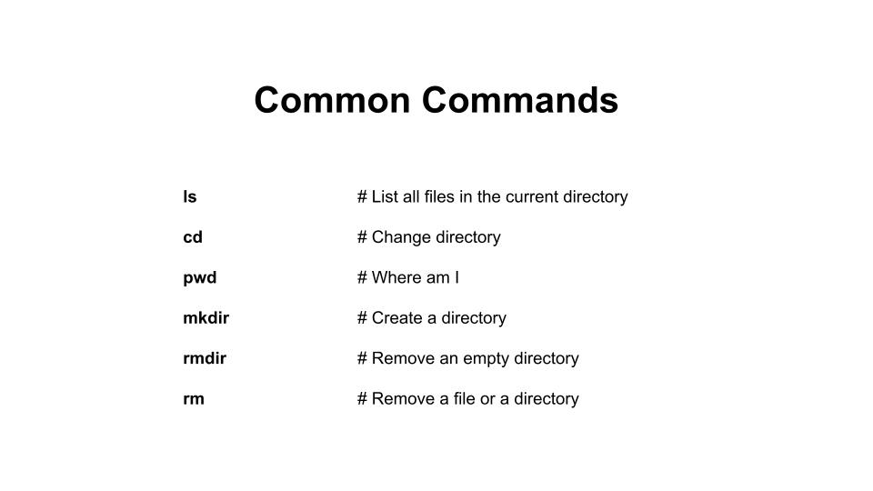
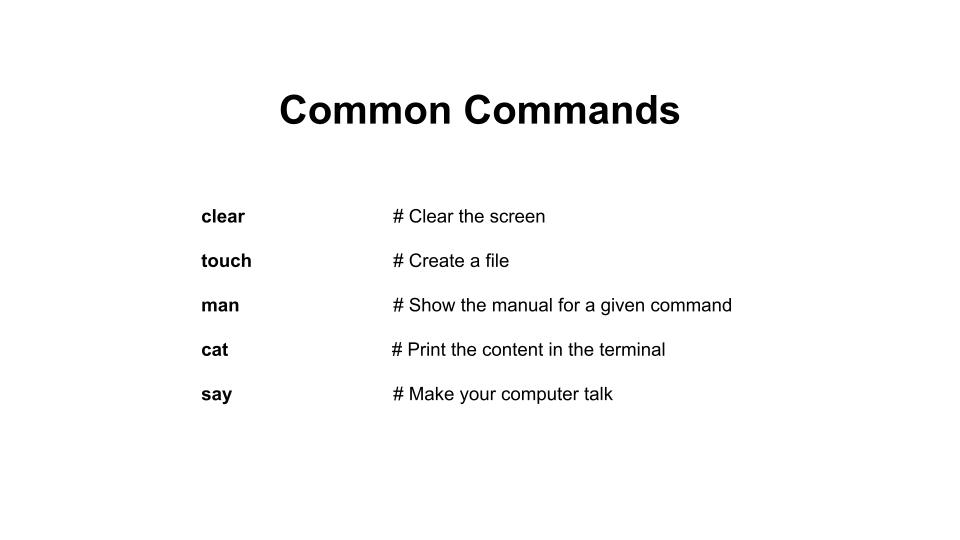

# Command Line 

### Objectives
- Know about the Command Line?
- Why we use Command Line?
- Make files and directory.
- View the files
- Detete and edit them
- How to Navigate 

----








### Paths and Directories
#### Absolute Paths
The absolute path shows the full path of files and it is unique location withini the file system. 
No other files can have this path.

Absolute paths:
- Start with leadiing slash '/' 
- Always relative to the root directory 


### Relative Paths
The Relative paths are the paths descrbed with respect to the current directory. 

There are two special relative directories.
- `..` parent directory
- `.`  current directory


## Lab: Make a T1000 directory
Create the following directories as well. They should be subdirectories of

Please, following structure below:

```sh
~/T1000
├── warmups
├── homeworks_labs
├── lessons
├── projects
```


### Additional Resources
- [Unix Power Tools](http://shop.oreilly.com/product/9780596003302.do)
- [Explain cli w3shools](https://www.w3schools.com/whatis/whatis_cli.asp)
- [Command Line Fu](http://www.commandlinefu.com/commands/browse)
- [Teaching Unix](http://www.ee.surrey.ac.uk/Teaching/Unix/)
- [Unix Cheat Sheet](https://www.rain.org/~mkummel/unix.html)


